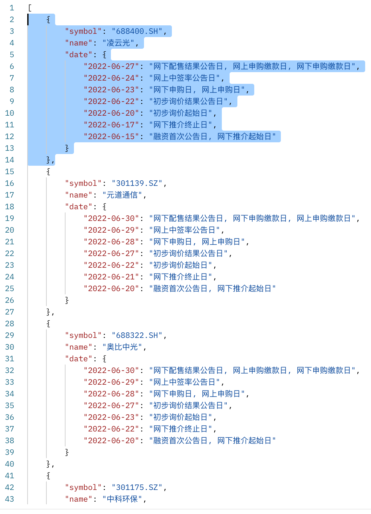

# 大癌股新股发行日历 New Stock Calender in China Market

此仓库为中国A股股市新股日历更新仓库。

本仓库每日更新，会对过去和未来4周的新股发行情况做简要展示。

## 使用

网页版访问：<https://newstock.techina.science>

API访问：<https://newstock.techina.science/data>

## 更新频率

每日（包括周末与节假日）

## 原理

设定Github Action后，通过脚本抓取数据后更新本仓库，并通过Github Page进行发布。

发布方式为网页版表格与API JSON。

## 数据结构展示

## 协议

本仓库遵循MIT协议。

